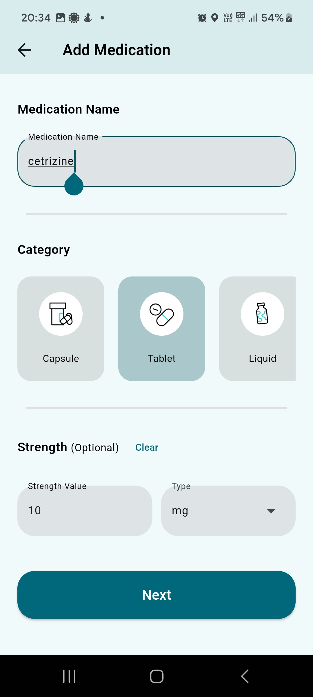

## **MediSync App**

#### A Flutter application, which you can save medicines and app will be send remind when you have to take it :bell: 

An IOMP by Armaan Shoaib 21261A05C0

For help getting started with Flutter, view our
[online documentation](https://flutter.dev/docs), which offers tutorials,
samples, guidance on mobile development, and a full API reference.

### App features :
- [x] Login & Signup feature
- [x] Save medicines in firebase database
- [x] Show notification in correct time
- [x] Delete medicines
- [x] Display detailed info about medicine
- [x] Multiple notification times
- [x] Frequency (Daily once, twice, once in 2 days, once in x day etc.
- [x] Statistics (Pie Chart)
- [x] Check your BMI
- [x] Emergency calling feature

### Screenshots :

